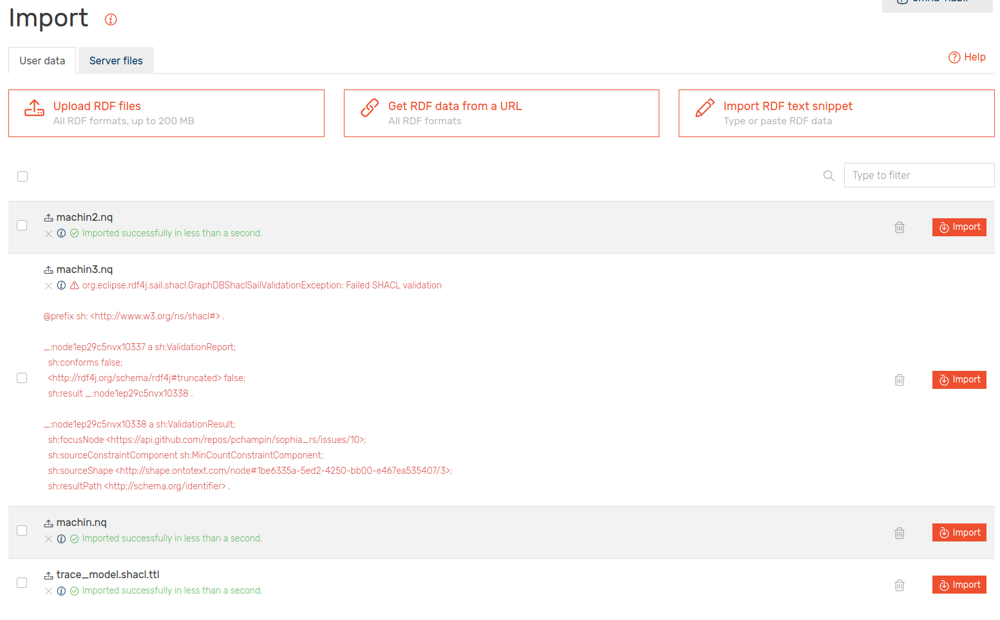

Emna Barred & Nabil Lamrabet

# Compte-rendu TP JSON-LD & GraphDB

Le contexte et le script se trouvent dans le fichier main.py


On récupère la trace avec le script `import_github_trace.py` :

```
 python3 import_github_trace.py pchampin/sophia_rs --out trace.json
```

On stocke la trace dans une variable `data` :

```python
with open('trace.json') as json_file:
    data = json.load(json_file)
```

On stocke notre dictionnaire dans une variable `context`.

Ensuite on `expand` et on exporte au format `n-quads` :

```python
expanded = jsonld.expand(data, {'expandContext': context})
normalized = jsonld.normalize(expanded, {'algorithm': 'URDNA2015',
'format': 'application/n-quads'})

f = open("machin.nq", "a")
f.write(normalized)
f.close()
```

Pour vérifier avec `pyshacl` que notre trace RDF est valide par rapport au `shapes graph` `trace_model.shacl.ttl` :

```
pyshacl -s trace_model.shacl.ttl -m -i rdfs -a -j -f human machin2.nq 
```

- Écrivez une requête SPARQL qui supprime tous les arcs s:identifier (ou n’importe quelle autre propriété requise sur une des shapes). Constatez que GraphDB refuse d’exécuter cette requête.

Commande SPARQL utilisée :

```SPARQL
PREFIX s:<http://schema.org/>
PREFIX ex: <http://example.com/ns#>
DELETE WHERE {?id s:identifier ?o}
```

- Videz la base avec la requête SPARQL CLEAR ALL. (NB: ceci ne vide pas le shapes graph).

```SPARQL

CLEAR ALL
```

- Créez une version modifiée de votre trace en RDF, dans laquelle un arc requis manque. Tentez d’importer ce fichier, et constatez que GraphDB refuse.

Nous avons créé un fichier machin3.nq avec la ligne suivante en moins :

```
<https://api.github.com/repos/pchampin/sophia_rs/issues/10>
<http://schema.org/identifier> "448362493"^^
<http://www.w3.org/2001/XMLSchema#integer> .
```

- Reprenez la version correcte de votre trace en RDF, et importez là à nouveau. Constatez que GraphDB accepte (sous réserve, bien sûr, que votre trace remplisse toutes les contraintes).

On peut voir que GraphDB refuse la version modifiée (machin3.nq) mais accepte la version initiale (machin2.nq qui est exactement le même fichier que machin.nq).

